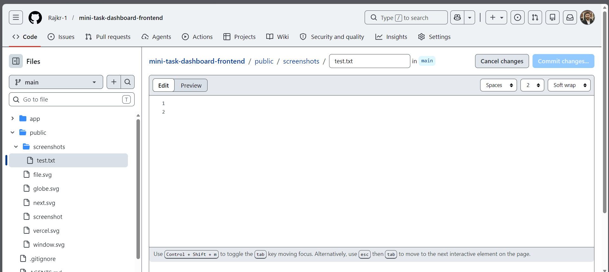

# Mini Task Dashboard

A full stack task management web application built using Next.js, Node.js, Express.js, and Supabase PostgreSQL.

---

## Live Demo

Frontend:[https://mini-task-dashboard-frontend.onrender.com]

Backend API: https://your-backend-url.onrender.com

---

## Features

- Create Tasks
- View Tasks
- Edit/Update Tasks
- Delete Tasks
- Task Status Management
- Due Date Tracking
- Responsive User Interface
- Toast Notifications
- Persistent Database Storage

---

## Tech Stack

### Frontend
- Next.js
- React.js
- Tailwind CSS
- Axios
- React Hot Toast

### Backend
- Node.js
- Express.js

### Database
- Supabase PostgreSQL

### Deployment
- Vercel (Frontend)
- Render (Backend)

---

## Folder Structure

```bash
MiniTaskDashboard
│
├── frontend
└── backend
```

---

## Installation & Setup

### Clone Repository

```bash
git clone YOUR_GITHUB_REPO_LINK
```

---

## Backend Setup

```bash
cd backend
npm install
```

Create `.env` file:

```env
SUPABASE_URL=your_supabase_url
SUPABASE_KEY=your_supabase_key
PORT=5000
```

Run backend:

```bash
npm run dev
```

---

## Frontend Setup

```bash
cd frontend
npm install
npm run dev
```

---

## API Endpoints

| Method |   Endpoint     | Description     |
|--------|----------------|-----------------|
| GET    | /api/tasks     | Fetch all tasks |
| POST   | /api/tasks     | Create new task |
| PUT    | /api/tasks/:id | Update task     |
| DELETE | /api/tasks/:id | Delete task     |

---

## Screenshots

### Dashboard

Add screenshot here after deployment.

```md

```

---

## AI Tools Used

- GitHub Copilot
- Claude

---

## Future Improvements

- User Authentication
- Task Filtering
- Search Functionality
- Drag & Drop Tasks
- Dark Mode

---

## Author

Raj Kumar
